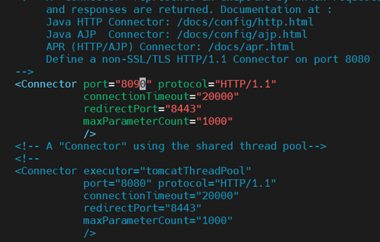

# CICD PIPELINE PROJECT
This is a CICD pipeline project using AWS, Jenkins and Maven where a website is hosted in a server and monitored and changes down through git.
 
 Before getting this is the code of website where I connected to the Jenkins.
 
 Github link for Website code [Link here](https://github.com/sai09kumar/SimpleWebApp.git)

 This is the Github Link of Html and CSS code

 ## Task 1
 Create a Jenkin server in AWS and give required requirements to it.

 

 Now go to the MobaXterm and connect the server and run the following command

```command
sudo apt update
sudo apt install default-jdk
sudo apt install default-jre

```
This is where we install Java in server and after running these commands automatically these steps down


After installing java we have to install Jenkins, so to install Jenkins we have to run following commands in terminal.

```commands
sudo wget -O /etc/yum.repos.d/jenkins.repo \
    https://pkg.jenkins.io/redhat/jenkins.repo
sudo rpm --import https://pkg.jenkins.io/redhat/jenkins.io-2023.key
sudo dnf upgrade
# Add required dependencies for the jenkins package
sudo dnf install java-17-openjdk
sudo dnf install Jenkins


```
Run these commands one by one so that Jenkins installed and after once Jenkins installed restart the server by following commands 
```commands
sudo systemctl enable Jenkins
sudo systemctl enable Jenkins
sudo systemctl status Jenkins

```
Jenkins successfully installed in the server, now copy the public ip and run it in browser with :8080
Now select install Jenkins and create user name and password

Username and password 

Task 1 is successfully completed by installing Jenkins in Ubuntu Server

## Task 2

Here we install tomcat server in the server
To install tomcat server we need to follow following commands
1.Go to Tomcat website and download option and select version


Select the Tar version and we can untar in server

To install use command

`wget tomcat file address`


To untar use command
`tar -xvzf  “file name”`

Now go to Tomcat file by using

`cd “Tomcat File name”`

Now go to bin file and run command

`./shutdown.sh`


After that start again by running

`./startup.sh`

This will open up a port for our application
and you are ready for connect the server in website

We have succesfully installed Jenkins and Tomcat in one server but in general Tomcat and Jenkins donot run in one port so we have to change port no. for Tomcat

to change go to Tomcat directory and run folowing command 

```
cd ..
cd conf
vi xml.server

```
This runs


change port no. to 8090 by inserting `i`



and save this by command

`:wq`

After this go again to bin directory and run startup and shutdown commands
Now connect to tomcat server
using :8090 port number

Now click on manager app it shows error to correct it we need to edit contect.xml by seeing each file given in directory

Go to bin the to context directory and list the files by `ls` command

Now check each file by copying and pasting 


Now check each file and edit the errors by following way

`vi sudo -filename`


Correct following errors usin !<< and -- >
After checking all files go to manager apps in tomcat site now it asks password and username


It shows error now we have to edit tomcatusers.xml 

To edit users and password go to bin directory and edit tomcat-users.xml


Copy the following commands in it

```<role rolename="manager-gui"/>
   <role rolename="manager-script"/>
   <role rolename="manager-jmx"/>
   <role rolename="manager-status"/>
   <user username="admin" password="admin" roles="manager-gui, manager-script, manager-jmx, manager-status"/>
   <user username="deployer" password="deployer" roles="manager-script"/>
   <user username="tomcat" password="s3cret" roles="manager-gui"/>

```

With no spaces and save it and restart the service by startup and shutdown in bin directory
Now login to site with given user id and password


## Task 3

Now install deploy plugin in jenkins in avaliable plugins and select install without restart after installing the plugin just restart the server


Restart Jenkins


Once installing we have to configure jenkins by going to manage credentials and giving the credentials for the Tomcat's server password and username.

Now go to global and give credentials

## Task 4

Now create a new freestyle project by giving name CICD_Project and attach github link and link with it.


Now attach github link and select the Maven Version according to


and Maven Version


Now go to deploy war/ear container because we installed the deploy plugin  and give war path as we don't know path select `?`
and select war path and give the credential path and also give url of tomcat server


Click on save and apply

Now click on build now and build the webapp

Now go to terminal and go to `webapps` directory

Now if we go to terminal and check `ls` we can find a `webapp.war` file 


Now you can go to website deployed and check the website deployed
by typing `ip address/webapp`


## Task 4

If we want to change any code in the then we can change in github as well as also using the git

Let's change the code from Big Sale shopping site to "Big Sale Website" and also "Flipkart offers ends on 1st May"


1. Go to Github
2. Change the code
3. Go to Jenkins
4. And again do Build now
5. After that, refresh your browser page or open new tab with URL http://localhost:8

Here we changed the code


Now let's build again the Jenkins and see the affect it puts in the live server


To avoid repeating again to build again and again we can just Pollscm for 2 minutes so that whenever code updated then automatically jenkins update the code 


This is how we deploy a live website on server and manage. 